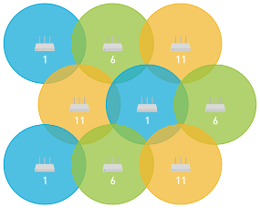
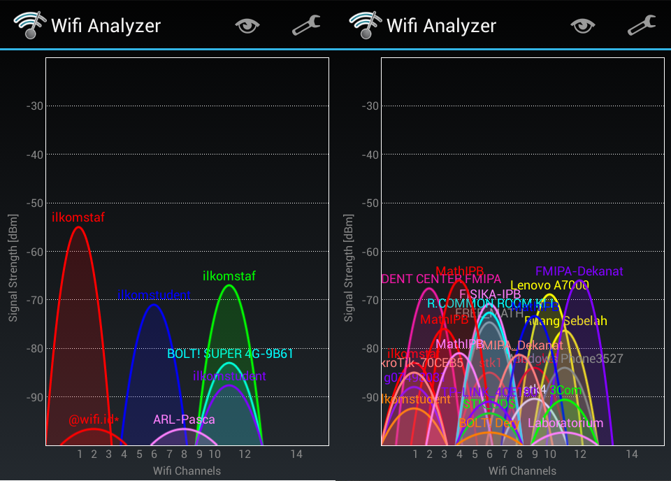

% Komunikasi Data dan Jaringan Komputer
  Praktikum #3
% Auriza Akbar
% 2015

# Jaringan Nirkabel (Wireless)

Tujuan: mahasiswa akan dapat membuat infrastruktur jaringan nirkabel.

Standar wireless LAN yang paling banyak dipakai adalah standar IEEE 802.11 (Wi-Fi).
Wi-Fi sebagian besar beroperasi pada pita frekuensi 2.4 GHz dan beberapa pada 5 GHz.
Standar Wi-Fi yang banyak dipakai adalah 802.11n yang mendukung *dual band* dan antena *multiple-input multiple-output* (MIMO) hingga 4 buah.
Standar Wi-Fi terbaru di pasaran adalah 802.11ac yang mendukung MIMO hingga 8 buah.

802.11  Frekuensi (GHz)     *Bandwidth* (MHz)   *Stream rate* (Mbps)    MIMO *Range* (m)
------  ---------------     -----------------   --------------------    ---- -----------
--      2.4                 22                  1--2                    --   20
a       5.0                 20                  6--54                   --   35
b       2.4                 22                  1--11                   --   35
g       2.4                 20                  6--54                   --   38
n       2.4/5.0             20,40               7.2--150                4    70
ac      5.0                 20,40,80,160        7.2--867                8    35

: Standar *wireless* IEEE 802.11

## Frekuensi 2.4 GHz

Standar 802.11b/g/n menggunakan frekuensi 2.4 GHz pada rentang spektrum 2.400--2.500 GHz.
Rentang tersebut dibagi menjadi 14 *channel* yang lebarnya masing-masing 20 MHz.
Tiap *channel* terpisah 5 MHz, dimulai dari *channel* 1 dengan frekuensi pusat 2.412 GHz.
Untuk instalasi beberapa perangkat WiFi, perlu dipilih *channel* yang tidak *overlap* untuk meminimalkan interferensi.
Contoh *non-overlap channel* yang banyak dipakai adalah *channel* 1, 6, dan 11.

Lebar *channel* dapat diubah menjadi 40 MHz untuk meningkatkan *data rate* dua kali lipat.
Contohnya adalah *channel* 3 (1+5) dan 11 (9+13).
Namun penggunaannya tidak disarankan pada jaringan bersama, karena akan sulit menghindari *overlap* dengan *channel* lainnya.

Berikut adalah contoh instalasi beberapa perangkat WiFi pada jaringan bersama.
Pemilihan *channel* perlu diperhatikan untuk menghindari interferensi yang menyebabkan penurunan kinerja hingga 60%.

Untuk memilih channel, kita harus melihat channel mana saja yang masih kosong dan tidak terlalu *crowded*.
Gunakan aplikasi "inSSIDer" pada Windows atau "Wifi Analyzer" pada Android.

## Enkripsi

- Unsecured
- WEP
- WPA: TKIP
- WPA2: AES
- WPA2 Enterprise: server Radius

## Mode Kerja

- *Access Point* (AP): untuk meng-*extend* jaringan LAN untuk klien *wireless*

- *Repeater*: untuk memperluas jangkauan *wireless* AP

- *Router*: untuk membuat jaringan *wireless* baru

## Roaming pada Multiple AP

Untuk memanfaatkan fitur *roaming*, gunakan SSID dan setting *security* yang sama pada setiap AP yang dipasang.
Jika klien berpindah tempat dan sinyal AP lemah, klien dapat berpindah ke AP lain secara otomatis tanpa melakukan koneksi ulang.

## Setting TP-Link WiFi router TL-WR741ND

Simulator: <http://www.tp-link.com/resources/simulator/TL-WR741ND_v1&v2/index.htm>

- Nyalakan device
- Tekan tombol reset sampai semua lampu menyala (+- 7 detik)
- Colokkan kabel straight dari PC ke port LAN (kuning)
- Colokkan kabel straight dari jaringan ke port WAN (biru)
- Akses ke <http://192.168.1.1> dengan user:admin password:admin
- "Quick Setup"
    - WAN connection type: **Auto-Detect**
    - Wireless
        - SSID: ...
        - Region: **Indonesia**
        - Channel: **[1, 6, 11]**
        - Mode: **Mixed**
        - Channel Width: **20 MHz**
        - Security: **WPA2-PSK**
        - PSK password: ...
- Reboot
- "System Tools"
    - Password
        - Ganti username dan password
    - Time setting
        - Time zone: **GMT +7**
        - Klik "Get GMT"

## Setting TP-Link WiFi AP TL-WA901ND

Simulator: <http://www.tp-link.com/resources/simulator/TL-WA901ND_V3/Index.htm>

- Nyalakan device
- Tekan tombol reset sampai semua lampu menyala (+- 7 detik)
- Colokkan kabel straight dari PC ke port LAN
- Akses ke <http://tplinkap.net> dengan user:admin password:admin
- "Quick Setup"
    - Country/Region: **Indonesia**
    - Change the login account: **Yes**
        - Ganti username dan password
    - Mode: **Access Point**
    - Wireless
        - SSID: ...
        - Channel: **[1, 6, 11]**
        - Security: **WPA2-PSK**
        - Password: ...
    - Network
        - Type: **Smart IP (DHCP)**
        - DHCP Server; **Disable**
    - Finish
- "Wireless"
    - Channel width: **20 MHz**
- Colokkan kabel straight dari jaringan ke port LAN
