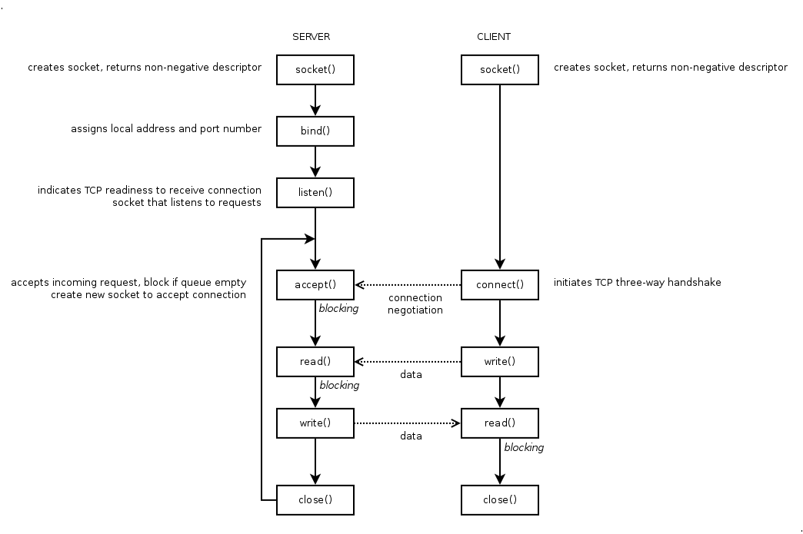

% Komunikasi Data dan Jaringan Komputer
  Praktikum #4
% Auriza Akbar
% 2015

# Pemrograman Soket TCP

<!--
TODO:
PF_INET
send()/recv()
listenfd -> serversock
connfd   -> clientsock

AGENDA:
write code line-by-line
explanation every function
-->

Tujuan: mahasiswa akan dapat membuat program soket pada Linux

Soket adalah abstraksi untuk komunikasi jaringan, sama halnya seperti _file_ adalah abstraksi untuk komunikasi dalam _filesystem_. Praktikum kali ini membahas fungsi I/O jaringan dasar untuk Linux. Aplikasi yang melakukan I/O jaringan harus bisa melakukan fungsi dasar berikut ini:

- `open`: mempersiapkan untuk operasi I/O
- `close`: memberhentikan operasi sebelumnya dan mengembalikan sumber daya
- `read`: mendapatkan data dan menempatkannya ke dalam memori aplikasi
- `write`: menuliskan data dari memori aplikasi dan mengirimkan kontrol
- `control` (ioctl): mengatur opsi, seperti ukuran _buffer_ dan perilaku koneksi

Intinya, anggap saja soket adalah sebuah _file_ yang bisa dibuka, ditutup, dibaca, dan ditulis. Soket dikenali dengan sebuah _integer_ yang disebut _socket descriptor_ (pointer ke struktur data yang berisi deskripsi soket). Struktur data tersebut berisi: jenis soket, alamat dan port lokal yang dipakai, dan alamat dan port _remote_ yang akan menerima komunikasi dari soket.

Penggunaan soket terbagi menjadi dua:

- Soket pasif: soket yang bertindak sebagai server dan menunggu koneksi yang masuk
- Soket aktif: soket yang digunakan oleh program klien untuk menginisialisasi koneksi ke server


## Alur Penggunaan Soket TCP




Kode Program untuk Server
-------------------------

`server.c`

```c
#include <stdio.h>
#include <stdlib.h>
#include <unistd.h>
#include <arpa/inet.h>

int main(int argc, char *argv[])
{
    int listenfd;
    int connfd;
    int port = 2000;

    /* 1. Membuat soket */
    listenfd = socket(AF_INET, SOCK_STREAM, 0);

    struct sockaddr_in server_addr = {              /* alamat server */
        .sin_family = AF_INET,
        .sin_port = htons(port),
        .sin_addr.s_addr = INADDR_ANY
    };

    /* 2. Memberikan alamat ke soket */
    bind(listenfd, (struct sockaddr*) &server_addr, sizeof (struct sockaddr_in));

    /* 3. Listen -> soket pasif */
    listen(listenfd, 5);
    printf("Listening...\n");

    while (1) {

        /* alamat klien */
        struct sockaddr_in client_addr;
        socklen_t client_addr_size = sizeof (struct sockaddr_in);

        /* 4. Membuat soket untuk menerima koneksi dari klien */
        connfd = accept(listenfd, (struct sockaddr*) &client_addr, &client_addr_size);

        /* cetak alamat klien */
        printf("Connected with %s:%d.\n", inet_ntoa(client_addr.sin_addr), ntohs(client_addr.sin_port));

        /* kirim pesan ke klien */
        char server_msg[] = "+OK Welcome, type your message.\n";
        write(connfd, server_msg, sizeof server_msg);

        /* baca pesan dari klien */
        char client_msg[80] = {0};
        read(connfd, client_msg, sizeof client_msg);
        printf("Client said: %s", client_msg);

        /* balas pesan ke klien */
        char server_reply[] = "+OK Message accepted. Bye!\n";
        write(connfd, server_reply, sizeof server_reply);

        /* 5. Tutup koneksi klien */
        close(connfd);
    }

    /* Tutup soket */
    close(listenfd);

    return 0;
}
```

Jalankan program di atas. Jika gagal _binding_, gunakan port lainnya.
```bash
./server
```

Untuk sementara, gunakan `telnet` sebagai klien untuk melakukan komunikasi dengan server.
```bash
telnet 127.0.0.1 2000
```

Coba buat dua sesi klien yang mengakses server secara bersamaan, apa yang terjadi? Mengapa demikian? Apa yang bisa diperbaiki pada server agar bisa melayani beberapa klien sekaligus?

<!--

### Kode program server dalam bahasa Python

`server.py`

```python
import socket
import sys

HOST = ''
PORT = 2001

s = socket.socket(socket.AF_INET, socket.SOCK_STREAM)
print 'Socket created.'

s.bind((HOST, PORT))
print 'Socket bind complete.'

s.listen(5)
print 'Socket now listening...'

while 1:
    #wait to accept a connection (blocking)
    conn, addr = s.accept()
    print 'Connected with ' + addr[0] + ':' + str(addr[1])

    conn.send('+OK Welcome, type your message.\n');

    data = conn.recv(80)
    print 'Client said: ' + data

    reply = '+OK Message accepted. Bye!\n'
    conn.send(reply)

    conn.close()

s.close()

```
-->

## Kode Program untuk Klien

`client.c`

```c
#include <stdio.h>
#include <stdlib.h>
#include <unistd.h>
#include <arpa/inet.h>

int main()
{
    int socketfd;
    char *server_host = "127.0.0.1";
    int   server_port = 2000;

    /* 1. Membuat soket */
    socketfd = socket(AF_INET, SOCK_STREAM, 0);

    struct sockaddr_in server_addr = {              /* alamat server tujuan */
        .sin_family = AF_INET,
        .sin_port = htons(server_port)
    };
    inet_aton(server_host, &server_addr.sin_addr);

    /* 2. Koneksi ke server --> soket aktif */
    connect(socketfd, (struct sockaddr*) &server_addr, sizeof server_addr);

    /* baca pesan dari server */
    char server_msg[80] = {0};
    read(socketfd, server_msg, sizeof server_msg);
    printf("%s", server_msg);

    /* kirim pesan ke server */
    printf("> ");
    char client_msg[80] = {0};
    fgets(client_msg, sizeof client_msg, stdin);
    write(socketfd, client_msg, sizeof client_msg);

    /* baca balasan dari server */
    char server_reply[80] = {0};
    read(socketfd, server_reply, sizeof server_reply);
    printf("%s", server_reply);

    /* 3. Tutup koneksi ke server */
    close(socketfd);

    return 0;
}
```

Jalankan program di atas.
```bash
./client
```

<!--

### Contoh klien HTTP ke suatu server

`client-http.c`

```c
#include <stdio.h>
#include <stdlib.h>
#include <unistd.h>
#include <arpa/inet.h>

int main()
{
    int socketfd;
    char *server_host = "172.17.0.63";
    int   server_port = 80;

    /* 1. Membuat soket */
    socketfd = socket(AF_INET, SOCK_STREAM, 0);

    struct sockaddr_in server_addr = {              /* alamat server tujuan */
        .sin_family = AF_INET,
        .sin_port = htons(server_port)
    };
    inet_aton(server_host, &server_addr.sin_addr);

    /* 2. Koneksi ke server --> soket aktif */
    connect(socketfd, (struct sockaddr*) &server_addr, sizeof server_addr);

    /* kirim request ke server */
    char request[] = "GET / HTTP/1.0\nHost: 172.17.0.63\n\n";
    send(socketfd, request, sizeof request, 0);

    /* baca respon dari server */
    char server_msg[4096] = {0};
    recv(socketfd, server_msg, sizeof server_msg, 0);
    printf("%s", server_msg);

    /* 3. Tutup koneksi ke server */
    close(socketfd);

    return 0;
}

```

-->

## Tugas

- buat program klien untuk koneksi ke server web ipb.ac.id, simpan outputnya ke dalam buffer sebesar 4 KB
- ubah kode program server dan klien di atas ke dalam bahasa Python

<!--

```python
import socket

HOST = '127.0.0.1'
PORT = 2001

s = socket.socket(socket.AF_INET, socket.SOCK_STREAM)

s.connect((HOST, PORT))

server_msg = s.recv(80)
print server_msg,

client_msg = raw_input('> ')
s.send(client_msg)

server_reply = s.recv(80)
print server_reply

s.close()

```
-->

Referensi
---------
- Davis K, Turner JW, Yocom N. 2004. _The Definitive Guide to Linux Network Programming_. Berkeley (US-CA): Apress.
