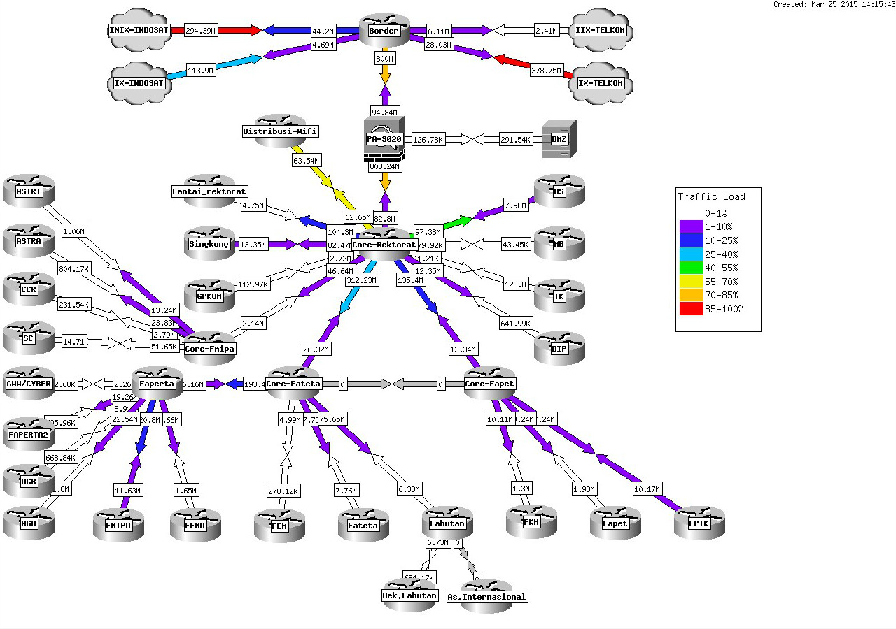
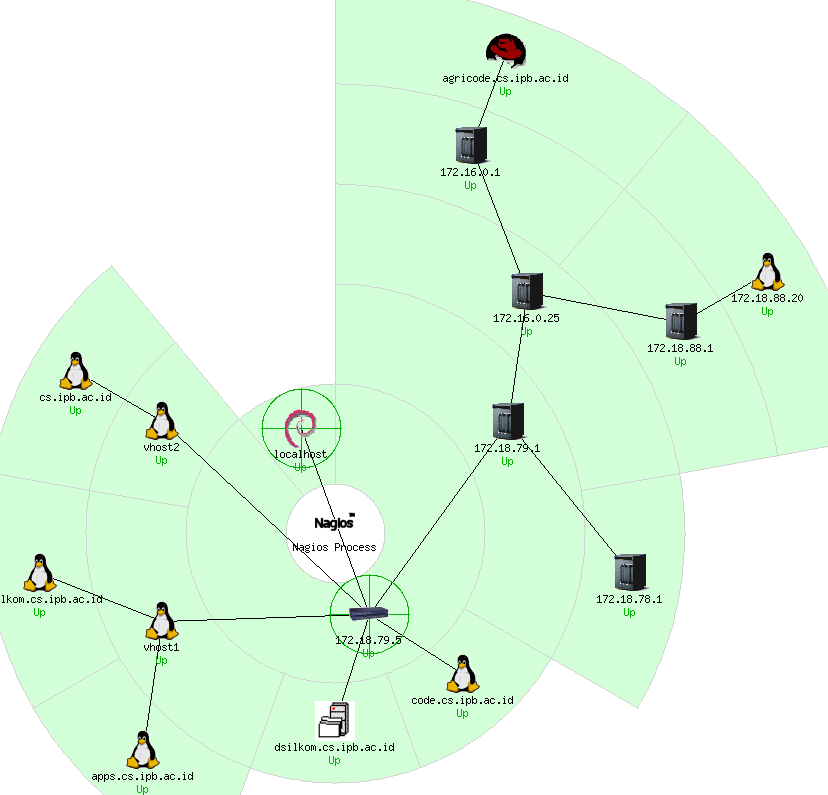

% Komunikasi Data dan Jaringan Komputer
  Praktikum #7
% Auriza Akbar
% 2015

# Aplikasi Jaringan


## *Troubleshooting*

### `hostname`

- untuk mengetahui nama host komputer
- untuk mengetahui alamat IP komputer

```bash
# nama komputer
hostname

# alamat IP komputer
hostname -I
```

### `ping`

- untuk mengecek apakah sebuah *host* hidup
- mengirimkan paket ICMP ECHO_REQUEST ke *host* target dan menunggu balasannya
- lazim digunakan untuk memberikan gambaran awal di mana letak masalah pada jaringan (contohnya, jika koneksi di kampus mati, ping dapat digunakan untuk mengetahui apakah masalahnya terletak pada jaringan di dalam kampus atau pada jaringan penyedia Internet).

```bash
ping <hostname>

# broadcast
ping -b <bcast_address>
```

### `traceroute`

- digunakan untuk mengetahui jalur ke host tujuan, termasuk rute yang ditempuh oleh paket dan waktu respon tiap host perantara
- dapat digunakan untuk mengetahui di mana letak masalah pada jaringan
- `traceroute` bekerja dengan mengatur *time-to-live* (TTL) paket keluar dengan nilai yang rendah
    - setiap paket melewati gateway, TTL berkurang satu
    - jika TTL bernilai 0, paket tersebut dibuang dan gateway mengirimkan pesan ICMP "time exceeded" ke host tujuan


```bash
traceroute <hostname>
```

### `ifconfig`

- untuk mengetahui informasi konfigurasi interface jaringan pada host
- satu host dapat memiliki lebih dari satu interface: loopback, ethernet, wireless, point-to-point
- alamat IP statis dapat langsung diketahui, alamat IP dinamis (DHCP) akan berubah secara periodik
- konfigurasi interface jaringan terletak pada berkas `/etc/network/interfaces`

```bash
ifconfig
```

### `host`

- untuk melihat alamat IP spesifik yang diasosiasikan dengan nama domain
- jika nslookup tidak bisa mendapatkan (resolve) informasi ini, maka terdapat gangguan pada DNS
- DNS digunakan oleh setiap orang yang memakai Internet untuk mengubah nama domain (contoh: ipb.ac.id) menjadi alamat IP (contoh: 202.124.205.244)
- konfigurasi server DNS yang dipakai oleh host terletak pada berkas /etc/resolv.conf

```bash
# menampilkan alamat IP dari sebuah domain
host <domain>

# menampilkan semua informasi DNS yang tersedia
host -a <domain>
```

- **latihan**: cari tahu alamat IP, alamat email admin, dan alamat *mail exchanger* dari domain ipb.ac.id


### `netstat`

- kumpulan beberapa informasi tentang status jaringan komputer:
    - menampilkan informasi konfigurasi interface
    - monitoring status koneksi jaringan
    - menampilkan servis jaringan yang sedang listening
    - menampilkan tabel routing
    - menampilkan statistik operasional berbagai protokol jaringan


```bash
# menampilkan konfigurasi interface
netstat -i

# monitoring status koneksi jaringan
netstat -a

# menampilkan servis yang sedang listening
netstat -l
netstat -lp

# menampilkan tabel routing
netstat -r
netstat -rn

# menampilkan statistik tiap protokol
netstat -s
```

### `route`

- untuk menampilkan tabel routing yang sedang digunakan
- untuk menambah atau mengurangi aturan pada tabel routing
- penting jika sebuah host memiliki banyak interface dan banyak pilihan gateway (sebuah PC bisa berfungsi sebagai router)
- arti dari flag: U (up), G (gateway), H (host), D (dynamic), ! (reject)

```bash
# menampilkan tabel routing
route

# mengatur default gateway, misalnya 192.168.1.1
route add default gw 192.168.1.1

# paket ke jaringan 192.168.3.0/24 akan di-forward ke interface 192.168.3.1
route add -net 192.168.3.0 netmask 255.255.255.0 gw 192.168.3.1

# memblok paket dari jaringan 192.168.3.0/24
route add -net 192.168.3.0 netmask 255.255.255.0 reject

# memblok paket dari host 192.168.4.1
route add -host 192.168.4.1 reject

# menghapus konfigurasi routing sebelumnya
route del -host 192.168.4.1 reject
```
<!--
- Contoh konfigurasi:


# konfigurasi pada PC 192.168.1.[2-3]
route add default gw 192.168.1.1

# konfigurasi pada PC 192.168.2.[2-3]
route add default gw 192.168.2.1

# konfigurasi pada GATEWAY
route add -net 192.168.1.0 netmask 255.255.255.0 gw 192.168.1.1
route add -net 192.168.2.0 netmask 255.255.255.0 gw 192.168.2.1
route add default gw 10.17.95.13
-->

### `nmap`

- port scanner, untuk mengetahui port yang terbuka pada suatu host
- juga informasi versi aplikasi dan sistem operasi yang digunakan

```bash
nmap <host>

nmap -A <host>
```


### `whois`

- untuk melihat info registrasi pemilik suatu domain

```bash
whois <domain>
```


## Komunikasi


### `wall`

- broadcast message ke seluruh user yang sedang login

```bash
echo "Hello" | wall
```

### `talk`

- chatting dengan user lain pada host yang berbeda

```bash
talk [user@host]
```

<!--
auriza@debian:~$ talk adminlab@172.18.78.101
[Trying to connect to your party's talk daemon]


adminlab@lab1-01:~$

Message from Talk_Daemon@lab1-01 at 9:54 ...
talk: connection requested by auriza@172.18.88.113.
talk: respond with:  talk auriza@172.18.88.113

talk auriza@172.18.88.113

-->

### `netcat`

- mencetak output dari jaringan ke layar

```bash
nc [host] [port]
```

- contoh:

```
host-a (listening):         host-b:
-------------------         -------
nc -l -p 2000               nc [host-a] 2000
```

## Monitoring

### `tcpdump`

- menampilkan dump paket traffic pada sebuah interface jaringan
- hasil outputnya (.pcap) dapat dianalisis lebih lanjut dengan Wireshark

```bash
# output ke stdout
tcpdump -i <interface>

# output ke file
tcpdump -i <interface> -w <file.pcap>
```

### Web-based

- Cacti <http://www.cacti.net/>
- MRTG <http://oss.oetiker.ch/mrtg/>
- SmokePing <http://oss.oetiker.ch/smokeping/>
- Nagios <http://www.nagios.org/>





## Bonus Film

```bash
telnet towel.blinkenlights.nl
```

## Tugas

Eksplorasi perintah berikut ini: `w3m`, `wget`, `ssh`, `scp`,  `rsync`, atau salah satu perintah di atas, coba opsi-opsi lainnya, dan tuliskan laporannya di blog.
